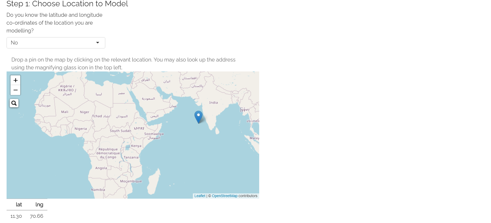
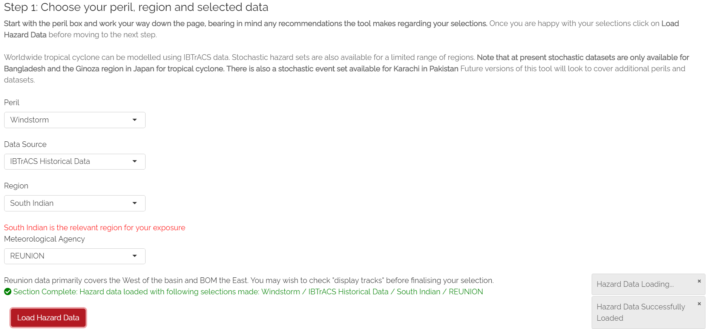
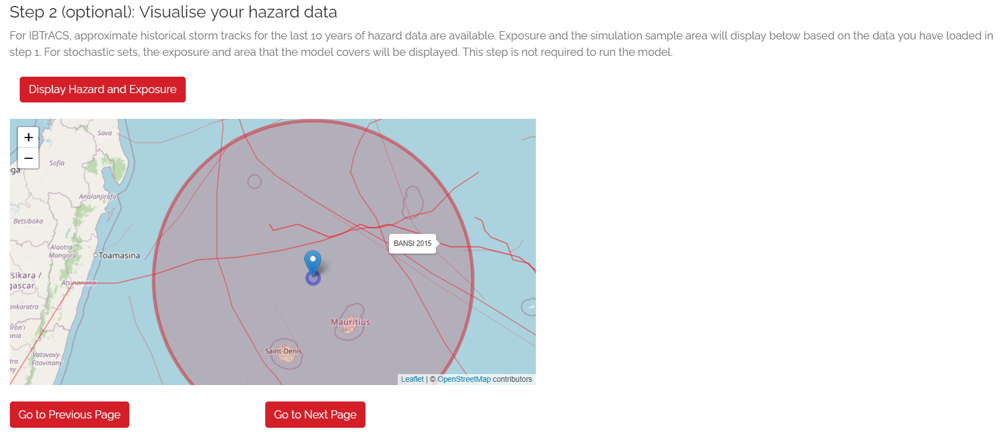

Navigating Through the Tool - User Instructions
============================================================

This section describes the use of each tab in the user interface and aims to guide the user through running the model from start to finish. Each tab has its own section
and it is suggested you move through each of these in sequence.

0. Introduction and Help
-----------------------------

**What does it do?**

These tabs are here purely as a reference for users and do not affect the app in any other way. The Introduction tab gives a brief overview of the tool similar to these help pages. The help tab is included purely to point users to the help pages.  

.. figure:: ../docs_img/Introduction.png
  :scale: 50%
  :alt: Risk Explorer Introduction Tab 
  
  Risk Explorer Introduction Tab 

.. figure:: ../docs_img/Help.png
  :scale: 50%
  :alt: Risk Explorer Help Tab 
  
  Risk Explorer Help Tab 

1. Exposure
-----------------------------

**What does it do?**

The :ref:`exposure<g_exposure_reference-label>` tab is where you should specify the assets or area you want to insure. The :ref:`exposure(s)<g_exposure_reference-label>` can be defined as a specific location or an area that is to be protected by the insurance cover. 

In version 1, :ref:`exposure<g_exposure_reference-label>` can be defined by either a single :ref:`latitude-longitude<g_latlong_reference-label>` point or a circle-shaped area around a specified point. This is because the only type of insurance covers that can be modelled in the tool are parametric covers which are generally defined in terms of co-ordinates on a map rather than physical assets (See :ref:`parametric_reference-label` for more info on the topic).

You would want to use a single location where there is one asset in particular you want to protect (e.g., a particular factory building or apartment block). Where you wish to cover a number of assets (e.g., a whole town, island or even a whole country), it would make more sense to use an area. You can experiment with the size of your circle until the required assets are covered.

The location or area you enter in this tab will ultimately feed through to your :ref:`simulations<g_simulation_reference-label>` when the modelling is run.  

**User Instructions**

**Step 1: Enter the latitude/longitude co-ordinates of the location or centre of the area you are interested in covering:** There are three different ways you can enter these. The method you choose will depend on the information you have about your location/area.

* **If you know the latitude and longitude of the location/centre of the area then you can enter this directly:** Enter "Yes" to the first question in Step 1. You will then see two input boxes below the map where you can enter your :ref:`latitudes and longitudes<g_latlong_reference-label>`. Once you have entered both of these, the location you have selected will display on the map. Before moving to the next step, ensure the location selected on the map is what you were expecting.

* **If you know the address of the location/centre of the area then you can search for it directly:** Enter "No" to the first question in Step 1. Click the magnifying glass icon displayed in the top-left of the map screen. A text input box will appear where you can search for your address. The address search uses OpenStreetMap with addresses generally displayed in the native language of the country they are located in. Once you have entered your address and selected one of the options from the drop-down, the location you have selected will display on the map. There is a chance your address may not be listed If this is the case, you may need to enter your location using the third method outlined below. 

* **If you know neither the address or the latitude and longitude:** Enter "No" to the first question in Step 1. You should then use the map's zoom and drag functionality to find the approximate area you think your :ref:`exposure<g_exposure_reference-label>` is located in. Click on the map and the location you have selected will display. Keep clicking on the map and zooming as required until you have selected the location you wish to select.    

  
  Exposure Step 1 

**Step 2  : Specify the area  you want your insurance policy to cover.**

If you are looking to model a single location, you will be able to skip this step as the area around the location being covered is simply zero. If you are looking at modelling an area rather than a single location, you will specify the radius that you believe is representative of the area. This will define the total area in which the insurance cover will respond.     You can also easily experiment with different radii using the map.

It is suggested that you choose the smallest possible radius that captures the area you wish to cover. The reason for this is that any additional area specified is likely to increase the chance that you receive a pay-out when the area you are interested in covering isn't actually impacted by an :ref:`event<g_event_reference-label>`. This may sound like a good thing, but the more likely there is to be a :ref:`payout<g_payout_reference-label>`, the more expensive the insurance cover will ultimately be to buy.
Note that the tool currently only allows you to specify an area of up to 200km radius. This is to prevent calculation issues.

Once both steps have been completed you can move on to the next tab.

.. figure:: ../docs_img/Exposure_2.png
  :scale: 50%
  :alt: Exposure Step 2 
  
  Exposure Step 2 

**Appendix: Step 2: Why can only circles be entered here?**
At present, circles are the only :ref:`exposure<g_exposure_reference-label>` shapes that can be specified within the tool. There are a few benefits to using circles rather than squares/rectangles to mark out the :ref:`exposure<g_exposure_reference-label>` area:

* **Tropical cyclones are circular.** Using circles means the :ref:`exposure<g_exposure_reference-label>` area and simulation methodology tie in more closely with the :ref:`hazard<g_hazard_reference-label>` itself. This should also typically lead to less :ref:`payouts<g_payout_reference-label>` in cases where cyclones skirt the edge of an :ref:`exposure<g_exposure_reference-label>` area. This helps increase the likelihood of :ref:`payouts<g_payout_reference-label>` being triggered in response to :ref:`events<g_event_reference-label>` causing actual losses and keeps covers as affordable as possible.
* **Straightforward to specify.** Only one location and one radius parameter need to be entered.
It is worth bearing in mind that for :ref:`exposure<g_exposure_reference-label>` areas that are long and thin (e.g., a long line of locations along a coastline), the circle approach may not be optimal. While this is recognised as a limitation of the tool, only circles can be specified here to ensure the tool retains its simplicity.

2. Hazard
-----------------------------

**What does it do?**

The :ref:`hazard<g_hazard_reference-label>` tab is where you specify the types of :ref:`events<g_event_reference-label>` you want your insurance to cover and the data to be used to model them. The :ref:`perils<g_peril_reference-label>` and data sources you select here will be used in the simulation.

For Version 1, the only :ref:`peril<g_peril_reference-label>` that can be selected here is tropical cyclone and the only data source that can be selected is :ref:`IBTrACS<g_ibtracs_reference-label>` historical data. Other :ref:`perils<g_peril_reference-label>` and data sources will be added as the model is developed.

**User Instructions**

The :ref:`hazard<g_hazard_reference-label>` tab is where you specify the nature of the :ref:`events<g_event_reference-label>` you are interested in modelling as well as what source you will be using to model these :ref:`events<g_event_reference-label>`. There are a few input boxes here which will differ depending on the :ref:`peril<g_peril_reference-label>`/data set you are using. Make sure you enter these in the order they are listed on the page. The subsequent steps will guide you through appropriate selections for each of the dropdown boxes pictured in the screenshot below.

**Step 1.1: Select the peril you want to model:** A :ref:`peril<g_peril_reference-label>` is a specific type of :ref:`event<g_event_reference-label>` e.g., a tropical cyclone or an earthquake. For version 1 you will need to select Tropical Cyclone.

**Step 1.2: Select the dataset used to model your chosen peril:** Data can be either historical observation data or simulated data developed by catastrophe modelling experts. For version 1, you will need to select :ref:`IBTrACS<g_ibtracs_reference-label>` data in this step. :ref:`IBTrACS<g_ibtracs_reference-label>` is a historical tropical cyclone dataset that covers all regions. More detail on :ref:`IBTrACS<g_ibtracs_reference-label>` can be found in the  :ref:`glossary_reference-label` 

**Step 1.3: Select the specific region you are interested in modelling:** Note that the region groupings available are likely to differ depending on the :ref:`peril<g_peril_reference-label>` you select. This is due to different :ref:`perils<g_peril_reference-label>` having their roots in different natural phenomena and relying on data sources that may approach these groupings slightly differently.

For version 1, the regions available to select here are the different tropical cyclone :ref:`"basins"<g_basin_reference-label>` located around the world. Based on your inputs in the :ref:`exposure<g_exposure_reference-label>` tab, the model should provide a suitable recommendation for which basin to select. The model may in some circumstances suggest that there is no relevant basin to select. This is likely to mean that your :ref:`exposure<g_exposure_reference-label>` is not in a tropical cyclone impacted area and would therefore not lead to any :ref:`insured losses<g_payout_reference-label>`.

**Step 1.4: Select which meteorological agency to use as the data source:** For each :ref:`basin<g_basin_reference-label>`, :ref:`IBTrACS<g_ibtracs_reference-label>` data contains wind/track measurements from several :ref:`agencies<g_agency_reference-label>`. Most of these relate to national :ref:`meteorological agencies<g_agency_reference-label>` e.g., TOKYO is the Japanese :ref:`agency<g_agency_reference-label>` and CMA is the Chinese :ref:`agency<g_agency_reference-label>`. Measurements can differ between :ref:`agencies<g_agency_reference-label>`, so this is an important step. For some basins, the prompt below the input box may recommend that you choose a particular :ref:`agency<g_agency_reference-label>`. For more information on the different :ref:`meteorological agencies<g_agency_reference-label>`, please see the :ref:`glossary_reference-label`.

**Step 1.5: Load the data:** Once you are happy with your selections in the drop-downs above, select the "Load Hazard Data" button at the bottom of the page. There is also a button that displays the historical data on the map, this is available purely for illustrative purposes and for checking the appropriate basin has been selected. 

  
  Hazard Step 1: Note the suggested basin displayed below the region dropdown.   

**Step 2 (Optional): Display tracks on map:** Clicking the “Display Tracks” button will show the historic tracks of any cyclones in the :ref:`hazard<g_hazard_reference-label>` set. The :ref:`exposure<g_exposure_reference-label>` and the area within which observations will be sampled from for :ref:`simulations<g_simulation_reference-label>` will also be shown here. The main purpose of this step is to allow you to check you have selected the right region in the steps above. 

This step will also allow you to easily visualise recent cyclone activity around your :ref:`exposure<g_exposure_reference-label>`. Note that due to data limitations, only 6 hourly storm tracks and category 1 or above winds are displayed here. As such, tracks displayed will differ slightly from the more precise and extensive tracks used in the tool's calculation engine.

  
  Hazard Step 2: Historical storm tracks and simulation sampling area displayed on map.

3. Vulnerability 
-----------------------------

**What does it do?**

The :ref:`vulnerability<g_vulnerability_reference-label>` tab is where you specify how your insurance cover will work. This tab can also be used for experimenting with different types of cover designs. The terms of the insurance cover entered here will be used to calculate the :ref:`payouts<g_payout_reference-label>` from the different :ref:`simulations<g_simulation_reference-label>` run using the hazard and :ref:`exposure<g_exposure_reference-label>` data entered earlier.

Here, :ref:`vulnerability<g_vulnerability_reference-label>` defines how the physical :ref:`event<g_event_reference-label>` translates into damage/financial loss to your :ref:`exposure<g_exposure_reference-label>`. In the case of a parametric cover, the financial loss is solely defined by your trigger/insurance structure. As such, :ref:`vulnerability<g_vulnerability_reference-label>` and the insurance structure itself are essentially the same thing. 
In more traditional insurance covers, the :ref:`vulnerability<g_vulnerability_reference-label>` is a separate component to the insurance structure itself. :ref:`Payouts<g_payout_reference-label>` are defined in terms of financial loss rather than directly arising from the features of the :ref:`hazard<g_hazard_reference-label>` :ref:`event<g_event_reference-label>`. :ref:`Vulnerability<g_vulnerability_reference-label>` for these types of covers models how individual :ref:`events<g_event_reference-label>` lead to financial losses based on the individual characteristics of each :ref:`exposure<g_exposure_reference-label>`.

For version 1, this tab's sole set of inputs is the parametric insurance structure entered. In future versions, the user will be able to upload their own :ref:`vulnerability<g_vulnerability_reference-label>` functions to sit alongside financial structures for non-parametric covers.

**User Instructions**

**Step 1: Specify the trigger measure.** The trigger is a measurement that should be closely related to the intensity of the :ref:`event<g_event_reference-label>`. Recordings of the :ref:`trigger measure<g_triggermeasure_reference-label>` within your defined :ref:`exposure<g_exposure_reference-label>` area will determine the :ref:`payout<g_payout_reference-label>` received in an :ref:`event<g_event_reference-label>`. For example, wind speed or pressure (the two options selectable here) would be suitable triggers for a tropical cyclone, as they closely relate to the amount of damage likely to be caused to the :ref:`exposure<g_exposure_reference-label>`. If you select wind speed here you can then choose how you would like to enter the triggers in the trigger unit box (either in mph or km/h). For pressure, only millibars (mb) is available to select.

**Step 2: Enter the maximum payout that can be received under the cover.** Choose the amount and currency for the :ref:`maximum payout<g_maxpayout_reference-label>` under the cover. When setting the :ref:`maximum payout<g_maxpayout_reference-label>` amount, you may consider the likely economic cost of the most serious :ref:`events<g_event_reference-label>` to your location/area or the :ref:`loss<g_payout_reference-label>` levels at different probabilities of occurrence. E.g., you may want cover up to a 1 in 100-year :ref:`event<g_event_reference-label>`, which has a 1% probability of occurring in any given year. In insurance terms, this is known as the limit to the cover. While a larger limit obviously means a greater :ref:`payout<g_payout_reference-label>` when an :ref:`event<g_event_reference-label>` happens, it will also make the cover more expensive to purchase.   

.. figure:: ../docs_img/Vulnerability_1.png
  :scale: 50%
  :alt: Vulnerability Tab: Steps 1 and 2
  
  Vulnerability Tab: Steps 1 and 2

**Step 3: Choose your payout structure.** The columns for trigger or :ref:`payout percentage<g_percentpayout_reference-label>` highlighted in red in the table below are editable by double-clicking on the table. After making your edits, press Ctrl + Enter to save these and exit the table’s edit mode. Note that the :ref:`payout percentage<g_percentpayout_reference-label>` must be entered as a decimal so 40% of the maximum amount would be entered as 0.4. The :ref:`payout<g_payout_reference-label>` amounts will calculate based on the :ref:`payout percentages<g_percentpayout_reference-label>` and maximum value entered. 

The default values in the table reflect the :ref:`Saffir-Simpson hurricane categories<g_sscategory_reference-label>` but you can experiment with different :ref:`trigger values<g_triggervalue_reference-label>` and :ref:`payouts<g_payout_reference-label>` here too. 
You may want to edit the :ref:`payouts<g_payout_reference-label>`/triggers to reflect what you know about the cost of previous :ref:`events<g_event_reference-label>` for your area of :ref:`exposure<g_exposure_reference-label>`. The graph at the bottom will also update based on the values you enter in the table. This should act as a visual aid to see what :ref:`payouts<g_payout_reference-label>` you would receive for each value of the :ref:`trigger measure<g_triggermeasure_reference-label>`.
A few points to bear in mind when entering the :ref:`payout<g_payout_reference-label>` structure:

* With a wind speed trigger, payout percentages and :ref:`trigger values<g_triggervalue_reference-label>` should be entered in ascending order. 
* Note that you do not need to use all five trigger points here if you do not want to and can leave any extra rows at the bottom blank.
* The lowest row filled in the table must have the maximum of “1” entered as a :ref:`payout percentage<g_percentpayout_reference-label>`. This is because by definition, the :ref:`maximum payout<g_maxpayout_reference-label>` must be the largest amount payable under the cover 
* If you are still unsure what to enter for any of these fields, you can just use the default structure that is given in the tool.

.. figure:: ../docs_img/Vulnerability_2.png
  :scale: 50%
  :alt: Vulnerability Tab: Step 3
  
  Vulnerability Tab: Step 3

**Step 4: Choose the number of reinstatements of cover.** Select a number between 0 and 9 here (9 is the maximum as it's unlikely that there would be more than this selected for this type of cover). The number of :ref:`reinstatements<g_reinstatement_reference-label>` dictates how many times you can receive the total :ref:`maximum payout<g_maxpayout_reference-label>` in a year. If you have zero :ref:`reinstatements<g_reinstatement_reference-label>`, the cover will only pay up to your maximum once in a given year. Subsequent :ref:`events<g_event_reference-label>` after the :ref:`maximum payout<g_maxpayout_reference-label>` has been reached will only generate further :ref:`payouts<g_payout_reference-label>` if your cover reinstates. 
If you have one :ref:`reinstatement<g_reinstatement_reference-label>`, you would receive a :ref:`payout<g_payout_reference-label>` for up to two :ref:`maximum payout<g_maxpayout_reference-label>` :ref:`events<g_event_reference-label>`. This field defines the number of times the cover "reinstates" after being exhausted. In practice, the pricing for a cover with multiple :ref:`reinstatements<g_reinstatement_reference-label>` will differ to that of a single :ref:`event<g_event_reference-label>` cover. As such, the number of :ref:`reinstatements<g_reinstatement_reference-label>` should be given consideration when designing a risk transfer cover.

.. figure:: ../docs_img/Vulnerability_3.png
  :scale: 50%
  :alt: Vulnerability Tab: Step 4
  
  Vulnerability Tab: Step 4

4. Simulation 
-----------------------------

**What does it do?**

The simulation tab is where you run the simulation modelling that feeds the app's main outputs. 
The simulation engine for this first version is based on a simple and transparent methodology. The primary goal was to create a methodology which is quick to run and provides an entry point to catastrophe modelling, rather than to try and re-create the sophistication of more advanced catastrophe modelling approaches such as detailed windfield modelling over land. Other approaches and methodologies are possible, each with their own advantages, limitations and trade-offs.  In future versions we aim to enable users to import catastrophe model :ref:`stochastic<g_stochastic_reference-label>` :ref:`event sets<g_eventset_reference-label>`, which will have more sophisticated :ref:`hazard<g_hazard_reference-label>` modelling than this version. 

The background calculations going on in this tab are a lot more involved than the other sections, as such a more detailed description of the simulation method can be found in the :ref:`sim_workings_reference-label` section. 
A brief and relatively non-technical description is given below, however you will need to look at the more detailed explanation to fully grasp the method and its applications:

**Step 1: Random sampling of points within a reasonable distance of your exposure.** Each :ref:`simulation<g_simulation_reference-label>` represents one randomly selected area within a reasonable distance of the :ref:`exposure<g_exposure_reference-label>`. It may seem odd to do this when these randomly selected locations are different to your :ref:`exposure<g_exposure_reference-label>`, however this is an important step which prevents over-generalising from a limited history and is the founding principle of all catastrophe models. 

For example, if your :ref:`exposure<g_exposure_reference-label>` is within a very small area or is a single location, you could have been relatively lucky and not had any significant wind :ref:`events<g_event_reference-label>` despite a number having just missed in the previous 30 years. If we just used the history at the :ref:`exposure<g_exposure_reference-label>` point, we would assume there is zero risk when this is clearly not the case. This random sampling of different points allows us to build this natural variability into our estimate of the :ref:`expected payout<g_expectedpayout_reference-label>`.

**Step 2: Identify the events in the hazard data that would lead to insurance payouts.** For each :ref:`event<g_event_reference-label>` impacting the randomly selected areas/points in step 1, the method looks at which of these would have exceeded the triggers you specified in the :ref:`vulnerability<g_vulnerability_reference-label>` section. Insurance :ref:`payouts<g_payout_reference-label>` for the relevant events in each :ref:`simulation<g_simulation_reference-label>` will then be calculated for each :ref:`simulation<g_simulation_reference-label>` and :ref:`simulation-year<g_simyear_reference-label>`.

**Step 3: Average the payouts for each year of data and simulation.** This will give average payouts for each :ref:`simulation<g_simulation_reference-label>`. These are essentially historical averages of the :ref:`payouts<g_payout_reference-label>` from your cover at each simulated location/area generated in step 1 across all the years of data. 

**Step 4: Apply weightings to the insurance payouts calculated in each simulation.** In reality, areas closer to the :ref:`exposure<g_exposure_reference-label>` are likely to be more similar in their weather patterns and therefore more applicable to the :ref:`exposure<g_exposure_reference-label>`. We therefore give greater :ref:`weight<g_:ref:`weighting<g_weighting_reference-label>`_reference-label>` to :ref:`simulations<g_simulation_reference-label>` closer to the :ref:`exposure<g_exposure_reference-label>` in the final calculation of the :ref:`expected insurance payout<g_expectedpayout_reference-label>`. The :ref:`weighting<g_weighting_reference-label>` applied here is based on the distance of the simulated area to the :ref:`exposure<g_exposure_reference-label>`, so a :ref:`simulation<g_simulation_reference-label>` that falls further away from your :ref:`exposure<g_exposure_reference-label>` gets a lower :ref:`weighting<g_weighting_reference-label>`.

**Step 5: Calculate the total weighted average insurance payout across all simulations.** A weighted average is calculated for the total payout over the :ref:`hazard<g_hazard_reference-label>` data for all :ref:`simulations<g_simulation_reference-label>`. This should give us a view of the :ref:`expected payout<g_expectedpayout_reference-label>` for this cover which takes into account the variability of the data. 

In addition to the weighted simulation methodology, the tool will also output results based purely on history at the :ref:`exposure<g_exposure_reference-label>` location and using a non-weighted simulation method for comparison so you can see the impact of the :ref:`weighting<g_weighting_reference-label>` methodology. This is described in more detail in the subsequent output section.

**User Instructions**

Only run :ref:`simulations<g_simulation_reference-label>` once the :ref:`exposure<g_exposure_reference-label>`, :ref:`hazard<g_hazard_reference-label>` and :ref:`vulnerability<g_vulnerability_reference-label>` sections are complete as indicated by the checklist. Once you are happy with your inputs, you can specify the number of :ref:`simulations<g_simulation_reference-label>` you wish to run before clicking "Run Simulation". 

The more :ref:`simulations<g_simulation_reference-label>` you run, the more stable/reliable your output will be, however a higher number of :ref:`simulations<g_simulation_reference-label>` will take longer to run. If this tool is being used in a purely educational capacity, even 500 should produce meaningful output. It is suggested you try this amount initially to ensure there are no performance issues with your machine when running the tool. If you are running the tool for any purposes other than educational, it is recommended that you opt for 10,000 :ref:`simulations<g_simulation_reference-label>` to avoid any :ref:`convergence<g_convergence_reference-label>` issues.

A loading bar will appear during the simulation run and a notification will display once the results are ready to view. Note that this tab may take anywhere between 20 seconds and 10 minutes to run. This will heavily depend on: 

* The number of :ref:`simulations<g_simulation_reference-label>` you choose
* The size of the area selected in the :ref:`exposure<g_exposure_reference-label>` tab: Larger areas will take longer to run as each individual :ref:`simulation<g_simulation_reference-label>` will contain more :ref:`events<g_event_reference-label>`
* The :ref:`basin<g_basin_reference-label>` you have selected in the :ref:`hazard<g_hazard_reference-label>` section: Some basins are more active or contain more years of data than others
* The location of your :ref:`exposure<g_exposure_reference-label>`: More storm-prone areas will take longer to run because a :ref:`payout<g_payout_reference-label>` must be calculated on a greater number of :ref:`events<g_event_reference-label>`.

.. figure:: ../docs_img/Simulation.png
  :scale: 50%
  :alt: Simulation Tab
  
  Simulation Tab

5. Analysis
-----------------------------

**What does it do?**

The analysis tab is where detailed exhibits summarising the simulation modelling can be viewed. These tables, graphs and maps aim to give the user a clear summary of the main model outputs and support key learning outcomes. There are four exhibits on the Analysis tab that all address slightly different themes:

* **Exhibit 1: Historical Payouts Summary** Leaving aside :ref:`simulations<g_simulation_reference-label>`, what actually happened over the history at my location and what :ref:`payouts<g_payout_reference-label>` would I have received over the years?
* **Exhibit 2: Individual Simulation Summary** What does an individual :ref:`simulation<g_simulation_reference-label>` actually look like? How does each :ref:`simulation<g_simulation_reference-label>` vary?
* **Exhibit 3: Event Frequency and Return Periods** How often do different types of event occur?
* **Exhibit 4: Payout Frequency Summary** How often should I expect to receive different annual :ref:`payout<g_payout_reference-label>` amounts?

These are all covered in more detail below. The actual results and a more high-level summary of the modelling is available on the Results Summary tab. Note that output will only display on this page once :ref:`simulations<g_simulation_reference-label>` have been run.

**User Instructions**

**Exhibit 1: Historical Payouts Summary**

Exhibit 1 aims to give more insight into the :ref:`events<g_event_reference-label>` in the historical data that would have triggered your cover. The map displays the historical tracks for any relevant :ref:`events<g_event_reference-label>` and the table gives a summary of the events. Note that in many cases tracks are not precise as data is only available at 3–6-hour intervals requiring estimates to be made via :ref:`interpolation<g_interpolation_reference-label>` between available points.

The circle displayed on the map is the area within which a storm is deemed to cause a :ref:`loss<g_payout_reference-label>` to the :ref:`exposure<g_exposure_reference-label>` (75km, the assumed :ref:`RMW<g_rmw_reference-label>` plus the radius of :ref:`exposure<g_exposure_reference-label>` area), please see the :ref:`sim_workings_reference-label` section if you need more information on this. The wind speeds displayed are the maximum speeds recorded within the :ref:`exposure<g_exposure_reference-label>` circle. SID displays a unique ID for the storm and ISO time gives the time of the storm measurement/:ref:`interpolation<g_interpolation_reference-label>` using international standard time. 

.. figure:: ../docs_img/analysis_1.png    
  :scale: 50%
  :alt: Analysis Tab: Exhibit 1
  
  Analysis Tab: Exhibit 1
  
**Exhibit 2: Individual Simulation Summary**

Exhibit 2 allows you to look at the results of any individual :ref:`simulation<g_simulation_reference-label>` by selecting the relevant number in the input box. The table immediately below gives a summary of the main outputs of the simulation. The map and corresponding table display the :ref:`events<g_event_reference-label>` in the history that would have led to :ref:`payouts<g_payout_reference-label>` at each simulated location. 

The main purpose of this exhibit is to give more transparency on the simulation method and how we arrive at the simulated results figures in the Results Summary tab. The figures displayed here for each :ref:`simulation<g_simulation_reference-label>` should match what is in the exportable csv files on the Results Summary tab.

Note that payout-generating :ref:`events<g_event_reference-label>` are displayed as markers rather than tracks as in Exhibit 1. Only the track locations with :ref:`payout<g_payout_reference-label>`/:ref:`trigger values<g_triggervalue_reference-label>` (or minimum for pressure) are displayed due to the memory limitations imposed by loading tracks for thousands of :ref:`simulations<g_simulation_reference-label>`. Also note that if you enter an invalid number (e.g., a decimal figure or a number larger than the total amount of :ref:`simulations<g_simulation_reference-label>`), nothing will display in this exhibit.

.. figure:: ../docs_img/analysis_2.png  
  :scale: 50%
  :alt: Analysis Tab: Exhibit 2
  
  Analysis Tab: Exhibit 2
  
**Exhibit 3: Event Frequency and Return Periods**

Exhibit 3 gives an estimate of how often storms of each :ref:`Saffir-Simpson category<g_sscategory_reference-label>` occur in the history and in the simulation output: 

* **Frequency** refers to the number of storms of this category or above you would expect to see in a year. A :ref:`frequency<g_frequency_reference-label>` of 1 means that a storm would occur on average once a year. 

* **Return Period** refers to the average time you would have to wait before observing a storm of that category or above, e.g a :ref:`return period<g_returnperiod_reference-label>` of 5 years for a cat 2 storm means you would expect to have one storm at cat 2 or above every 5 years on average. Bear in mind these represent averages, and it is possible to have two 100-year :ref:`events<g_event_reference-label>` occur in subsequent years. Another way to think about :ref:`return periods<g_returnperiod_reference-label>` is the probability of occurrence in any given year. A 10-year :ref:`return period<g_returnperiod_reference-label>` means there is a 1 in 10 (10%) chance of an :ref:`event<g_event_reference-label>` happening in any given year.

This exhibit should be useful for examining why you might have a different result for your simulation method than you would have from the history at your :ref:`exposure<g_exposure_reference-label>`. It should also be useful for getting an idea of how common storms of each category are around your area of :ref:`exposure<g_exposure_reference-label>`. 

.. figure:: ../docs_img/analysis_3.png  
  :scale: 50%
  :alt: Analysis Tab: Exhibit 3
  
  Analysis Tab: Exhibit 3
  
**In some cases you may see NA displayed here. This means there are no storms of this category in the data.** Be careful using model output where no :ref:`events<g_event_reference-label>` are present in the data for higher storm categories. This should occur more frequently in the historical counts than in the :ref:`simulations<g_simulation_reference-label>`, where there is a larger number of observations to draw upon.

Note that the simulated :ref:`frequency<g_frequency_reference-label>` here is unweighted and takes all of the years with the same :ref:`weight<g_weighting_reference-label>`. There are limitations to this approach where there are areas that don't experience cyclone activity in the sampling area.

**Exhibit 4: Payout Frequency Summary**

Exhibit 4 shows the :ref:`frequency<g_frequency_reference-label>` of different annual :ref:`payout<g_payout_reference-label>` values in the simulation output. This exhibit should enable you to get an idea of the likely chances of seeing different :ref:`payout<g_payout_reference-label>` values in any given year. The table below provides some more context, showing the average simulation :ref:`weight<g_weighting_reference-label>` for each :ref:`payout<g_payout_reference-label>` and the cumulative :ref:`percentile<g_percentile_reference-label>`. Note that the :ref:`frequencies<g_frequency_reference-label>` shown in the chart are not weighted.

:ref:`Payouts<g_payout_reference-label>` shown here are cumulative throughout the year and capped by the total number of :ref:`reinstatements<g_reinstatement_reference-label>`. E.g., if you had a 60% :ref:`payout<g_payout_reference-label>` and a further 80% :ref:`payout<g_payout_reference-label>` in a given year with a :ref:`reinstatement<g_reinstatement_reference-label>` in place, this would appear as 140% in the chart.

.. figure:: ../docs_img/analysis_4.png  
  :scale: 50%
  :alt: Analysis Tab: Exhibit 4
  
  Analysis Tab: Exhibit 4
  

6. Results Summary
-------------------

This tab provides an overview of the high-level results. There are two outputs on this tab:

* **Results Exhibit:** Shows the distribution of the :ref:`average payout<g_expectedpayout_reference-label>` across each :ref:`simulation<g_simulation_reference-label>` as well as the :ref:`expected payout<g_expectedpayout_reference-label>` for each of the three main calculation methods.
* **Raw Model Output:** These are downloadable csv files containing the model output at different levels of granularity. These can be used to perform supplementary analysis or just to gain a better idea of the calculations underpinning the model. These files would also be a useful aid when reviewing the :ref:`sim_workings_reference-label` page in the FAQs.

**Display**

Note that output will only display on this page once the :ref:`simulations<g_simulation_reference-label>` have been run. The "Display Options" section at the top of the page gives you the choice of displaying :ref:`payout<g_payout_reference-label>` metrics  as actual currency amounts or as a :ref:`percentage of maximum payout<g_percentpayout_reference-label>`, which is frequently used in insurance markets. Looking at :ref:`percentage of maximum payout<g_percentpayout_reference-label>` enables us to easily compare the :ref:`expected payouts<g_expectedpayout_reference-label>` between covers regardless of the financial amount. In some cases, it can also be a useful guide to the expected :ref:`frequency<g_frequency_reference-label>` of :ref:`payouts<g_payout_reference-label>` under the cover.  

E.g., Consider a cover with only one trigger of USD 100,000. After running a large number of simulated years, the simulated average yearly loss is calculated to be 20,000 which is 20% of the :ref:`maximum payout<g_maxpayout_reference-label>`. This 20% gives us an idea of the annual :ref:`frequency<g_frequency_reference-label>` of :ref:`events<g_event_reference-label>` hitting the cover, i.e we would expect a :ref:`loss<g_payout_reference-label>` roughly every 1 in 5 years (as it has a 20% chance of occurring in any given year). A separate cover with a trigger of 1,000,000 also has a simulated :ref:`loss<g_payout_reference-label>` of 20,000 representing 2% of the maximum. We can see from the small percentage that this is quite a remote cover that we would only expect to see a :ref:`loss<g_payout_reference-label>` from roughly every 1 in 50 years. These covers are evidently quite different despite having the same :ref:`expected payout<g_expectedpayout_reference-label>` of 20,000 as one is hit far more often than the other and generally sustains more :ref:`losses<g_payout_reference-label>` relative to its :ref:`maximum payout<g_maxpayout_reference-label>`.

This simplification works very well with single trigger covers as we can directly pull out the :ref:`frequency<g_frequency_reference-label>` of :ref:`loss<g_payout_reference-label>`es. With multiple triggers we have to be a little more careful generalising, as there are :ref:`payouts<g_payout_reference-label>` at levels other than the maximum. Nevertheless, this rule of thumb should still give a good idea of how likely the cover is to pay out in most cases.

.. figure:: ../docs_img/results_1.png  
  :scale: 50%
  :alt: Results Tab: Display
  
  Results Tab: Display

**Expected Loss and Distribution by Calculation Method**

The main exhibit shows estimates of the :ref:`expected insurance payout<g_expectedpayout_reference-label>` under different calculation methods as well as the full distribution of the simulation output. The distribution shown on the graph by the solid red line orders the :ref:`simulations<g_simulation_reference-label>` from the highest to lowest :ref:`loss<g_payout_reference-label>` so you can see the range of outcomes you might expect across the simulated history. The x-axis gives the :ref:`payout rank<g_lossrank_reference-label>` of the simulation in the overall output (e.g. :ref:`rank<g_lossrank_reference-label>` 300 of 500 simulations is the simulation that generated the 300th highest average payout).The :ref:`expected payout<g_expectedpayout_reference-label>` using different methods is also displayed by horizontal lines on the graph. 
The bullets below describe what each method means and how it works. 

* **Historical Loss:** :ref:`This<g_historicalloss_reference-label>` method takes an average over the history for your :ref:`exposure<g_exposure_reference-label>` point or area. Simulations don't factor in to this method at all and it can simply be thought of as an average of the :ref:`payouts<g_payout_reference-label>` you would have received over the period. For example, let's assume the :ref:`hazard<g_hazard_reference-label>` data includes storms from 1978-2021. The data shows that over this period, your :ref:`exposure<g_exposure_reference-label>` area experienced 2 storms that would have each generated 100k USD :ref:`payouts<g_payout_reference-label>`. The total :ref:`payout<g_payout_reference-label>` is 200k averaged over the 44 years of data, so the :ref:`historical insurance loss<g_historicalloss_reference-label>` for a one-year period of cover in this example would be USD 4,545. 

* **Unweighted Simulation Loss:** :ref:`This<g_unweightedsimloss_reference-label>` is the average annual insurance payout across all your :ref:`simulations<g_simulation_reference-label>` with no :ref:`weighting<g_weighting_reference-label>` for proximity to the :ref:`exposure<g_exposure_reference-label>` applied. More detail on the simulation approach can be found in the :ref:`sim_workings_reference-label` section.

* **Weighted Simulation Loss:** :ref:`This<g_weightedsimloss_reference-label>` is the average annual insurance payout across all your :ref:`simulations<g_simulation_reference-label>` with a :ref:`weighting<g_weighting_reference-label>` for proximity to the :ref:`exposure<g_exposure_reference-label>` applied. This is one of the main outputs of the modelling exercise.

The table also shows the :ref:`standard deviations<g_stdev_reference-label>` which give an estimate of the variability of the :ref:`loss<g_payout_reference-label>`. The higher the :ref:`standard deviations<g_stdev_reference-label>`, the more variability there is in :ref:`payouts<g_payout_reference-label>` across years/:ref:`simulations<g_simulation_reference-label>`. This variability is often equated with uncertainty and is one of the additional factors considered when structuring and pricing insurance contracts.

It is also worth considering why different methods might show different :ref:`payouts<g_payout_reference-label>`. The below gives a few examples of how you might interpret these outputs but is by no means an exhaustive list:

* The :ref:`historical loss<g_historicalloss_reference-label>` is a lot lower than the :ref:`weighted<g_weightedsimloss_reference-label>` and :ref:`unweighted simulation loss<g_unweightedsimloss_reference-label>`: This could tell you that the :ref:`exposure<g_exposure_reference-label>` area has been relatively fortunate with how tracks have turned out as the surrounding area has been more heavily impacted.

* :ref:`Weighted simulation loss<g_weightedsimloss_reference-label>` is a lot lower than the :ref:`unweighted simulation loss<g_unweightedsimloss_reference-label>`: Areas further away from the :ref:`exposure<g_exposure_reference-label>` have markedly lower cyclone activity so the :ref:`weighted simulation loss<g_weightedsimloss_reference-label>` may be more reliable.

.. figure:: ../docs_img/results_2.png  
  :scale: 50%
  :alt: Results Tab: Main Exhibit
  
  Results Tab: Main Exhibit

**Export Results to Excel**

There are two raw model outputs that can be downloaded as CSVs:

**Download output for each simulation:** Each row in this file represents an individual :ref:`simulation<g_simulation_reference-label>` on the map. The variables displayed in the file are as follows:

      * Unmarked first column: Row identifier

      * sim_no: Simulation number. Each value represents a different simulated location

      * lng: Simulated :ref:`longitude<g_latlong_reference-label>` for the :ref:`simulation<g_simulation_reference-label>`

      * lat: Simulated :ref:`latitude<g_latlong_reference-label>` for the :ref:`simulation<g_simulation_reference-label>`

      * dist: Distance from the :ref:`exposure<g_exposure_reference-label>`. Note if this is an area then this is the distance from the centre of the area, not the edge.

      * weight: :ref:`Weighting<g_weighting_reference-label>` applied to each :ref:`simulation<g_simulation_reference-label>` in the final calculation

      * average_payout: The :ref:`average payout<g_expectedpayout_reference-label>` as a :ref:`percentage of maximum payout<g_percentpayout_reference-label>` for the given :ref:`simulation<g_simulation_reference-label>` across all :ref:`simulation-years<g_simyear_reference-label>`. Note there is no capping here for :ref:`reinstatements<g_reinstatement_reference-label>`

      * average_payout_capped: average_payout capped for the impact of any :ref:`reinstatements<g_reinstatement_reference-label>`

      * weighted_EL: This column is the :ref:`weight<g_weighting_reference-label>` multiplied by the average capped payout. Summing this column and dividing by the sum of the total weights should give the weighted simulation payout

**Output by Simulation/Data Year** Each row in this file represents the payout for a given year of the history for each :ref:`simulation<g_simulation_reference-label>`. The variables displayed in the file are as follows:

      * Unmarked first column: Row identifier

      * sim_no: Simulation number.    Each value of i represents a different simulated location

      * season: The relevant tropical cyclone season/year 

      * trigger_payout: The total :ref:`payout<g_payout_reference-label>` as a :ref:`percentage of maximum payout<g_percentpayout_reference-label>` for the given :ref:`simulation<g_simulation_reference-label>` and :ref:`simulation-year<g_simyear_reference-label>`. Note there is no capping here for :ref:`reinstatements<g_reinstatement_reference-label>`

      * trigger_payout_capped: trigger_payout capped for the impact of any :ref:`reinstatements<g_reinstatement_reference-label>`

      * weight: :ref:`Weighting<g_weighting_reference-label>` applied to each :ref:`simulation<g_simulation_reference-label>` in the final calculation. Note this is not the same as the :ref:`weighting<g_weighting_reference-label>` that would be given to each :ref:`simulation-year<g_simyear_reference-label>`

Note that any :ref:`payouts<g_payout_reference-label>` will always be displayed in terms of :ref:`percentage of maximum payout<g_percentpayout_reference-label>`. To convert these to financial amounts in spreadsheet software, multiply them by the :ref:`maximum payout<g_maxpayout_reference-label>` amount.

.. figure:: ../docs_img/results_3.png  
  :scale: 50%
  :alt: Results Tab: Export Results
  
  Results Tab: Export Results
