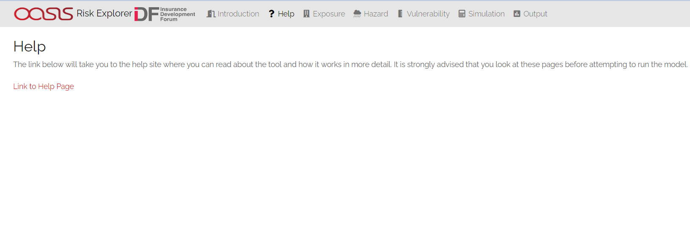
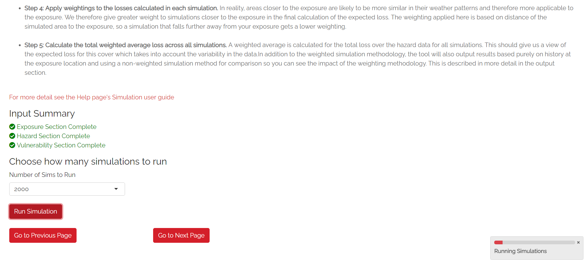

Navigating Through the Tool - User Instructions
============================================================

This section describes the use of each tab in the user interface and aims to guide the user through running the model from start to finish. Each tab has its own section
and it is suggested you move through each of these in sequence

0. Introduction and Help
-----------------------------

**What does it do?**

These tabs are here purely as a reference for users and do not affect the app in any other way. The Introduction tab gives a brief overview of the tool similar to what can be found in the help pages. The help tab is included purely to point users to the help pages.  

  
  Risk Explorer Introduction Tab 

  
  Risk Explorer Help Tab 

1. Exposure
-----------------------------

**What does it do?**

The exposure tab is where you should specify the assets you want to insure. The exposure(s) can be defined as a specific location or an area that is to be protected by the insurance cover. 

For version 1 the only types of exposures that can be entered into the tool are either a single latitude-longitude point or a circle-shaped area around a specified point. This is because the only type of insurance covers that can be modelled in the tool are parametric covers which are generally defined in terms of co-ordinates on a map rather than physical assets (See :ref:`parametric_reference-label` for more info on the topic).

You would want to use a single location where there is one asset in particular you want to protect (e.g. a particular factory building or apartment block). Where you wish to cover a number of assets (e.g. a whole town, island or even a whole country), it would make more sense to use an area. You can experiment with the size of your circle until the the required assets are covered.

The location or area you enter in this tab will ultimately feed through to your simulations when the modelling is run.  

**User Instructions**

**Step 1: Enter the latitude/longitude co-ordinates of the location or centre of the area you are interested in covering.**
There are three different ways you can enter these. The method you choose will depend on the information you have about your location/area.

  
  Exposure Step 1 

**If you know the latitude and longitude of the location/centre of the area then you can enter this directly:** Enter "Yes" to the first question in Step 1. You will then see two input boxes below the map where you can enter your latitudes and longitudes. Once you have entered both of these, the location you have selected will flash up on the map. Before moving to the next step, ensure the location selected on the map is what you were expecting.

**If you know the address of the of the location/centre of the area then you can search for it directly:** Enter "No" to the first question in Step 1.
A magnifying glass icon should be displayed in the top-left of the map screen, once you click on this a text input box should appear where you can search for your address. The address search is fed by OpenStreetMap with addresses generally displayed in the native language of the country they are located in. Once you have entered your address and selected one of the options from the drop-down, the location you have selected will flash up on the map. There is a chance your address may not be listed, if this is the case, you may need to enter your location using the third method outlined below. 

**If you know neither the address or the latitude and longitude:** Enter "No" to the first question in Step 1. You should then use the map's zoom and drag functionality to find the approximate area you think your exposure is located in. Click on the map and the location you have selected will flash up. Keep clicking on the map and zooming as required until you have selected the location you wish to select.

**Step 2: Specify the area  you want your insurance policy to cover.**

  
  Exposure Step 2 

If you are looking to model a single location, you will be able to skip this step as the area around the location being covered is simply zero. If you are looking at modelling an area rather than a single location, you will specify the size of a circle in this section. This will define the total area in which the insurance cover will respond. You can also easily experiment with different circle sizes using the map. 

It is suggested that you choose the smallest possible circle that captures the area you wish to cover. The reason for this is that any additional area specified is likely to increase the chance that you receive a pay-out when the area you are interested in covering isn't actually impacted by an event. This may sound like a good thing, but the more likely there is to be a payout, the more expensive the insurance cover will ultimately be to buy.

Once both steps have been completed you can move on to the next tab.

2. Hazard
-----------------------------

**What does it do?**

The hazard tab is where you specify the types of events you want your insurance to cover and the data to be used to model them. The perils and data sources you select here will feed into your modelling. The simulation tab later in the app will work directly off the hazard data you choose in this section.

For Version 1, the only peril that can be selected here is tropical cyclone and the only data source that can be selected is IBTrACS historical data. Other perils and data sources will be added as the model is developed.

**User Instructions**

The hazard tab is where you specify the nature of the events you are interested in modelling as well as what source you will be using to model these events. There are a few input boxes here which will differ depending on the peril/data set you are using. Make sure you enter these in the order they are listed on the page. The subsequent steps will guide you through appropriate selections for each of the dropdown boxes pictured in the screenshot below.

.. figure:: ../docs_img/Hazard.png
  :scale: 50%
  :alt: Hazard tab
  
  Hazard Tab: Note the suggested basin displayed below the region dropdown. 

**Step 1: Select the peril you want to model:** A peril is a specific type of event e.g. a tropical cyclone or an earthquake. For version 1 you will need to select Tropical Cyclone here.

**Step 2: Select the dataset used to model your chosen peril:** Data can be either historical observation data or simulated data put together by catastrophe modelling experts. For version 1, you will need to select IBTrACS data in this step. IBTrACS is a historical tropical cyclone dataset that covers all regions, more detail on IBTrACS can be found in the  :ref:`glossary_reference-label` 

**Step 3: Select the specific region you are interested in modelling:** Note that the region groupings available are likely to differ depending on the peril you select. This is due to different perils having their roots in different natural phenomena and relying on data sources that may approach these groupings slightly differently.
For version 1, the regions available to select here are the different tropical cyclone basins located around the world. Based on your inputs in the exposure tab, the model should provide a suitable recommendation for which basin to select. The model may in some circumstances suggest that there is no relevant basin to select. This is likely to mean that your exposure is not in a tropical cyclone impacted area and would therefore not lead to any insured losses.

**Step 4: Select the meteorological agency who's data you will be using:** IBTrACS data contains wind/track measurements for each basin from several agencies. Most of these relate to national agencies e.g. TOKYO is the Japanese agency and CMA is the Chinese agency. Measurements can differ substantially between agencies, so this is an important step. For some basins, the prompt below the input box may recommend that you choose a particular agency. For more information on the different meteorological agencies, please see the :ref:`glossary_reference-label`.

**Step 5: Load the data:** Once you are happy with your selections in the drop-downs above, select the "Load Hazard Data" button at the bottom of the page. There is also a button that displays the historical data on the map, this is available purely for illustrative purposes and for checking the appropriate basin has been selected. 

3. Vulnerability 
-----------------------------

**What does it do?**

The vulnerability tab is where you choose exactly how your insurance cover will work. This tab can also be used for experimenting with different types of cover designs. The terms of the insurance cover entered here will be used to calculate the payouts from the different simulations run using the hazard and exposure data entered earlier.

Vulnerability also has a slightly different definition, it defines how the physical event translates into damage/financial loss to your exposure. In the case of a parametric cover, the financial loss is solely defined by your trigger/insurance structure. As such, vulnerability and the insurance structure itself are essentially the same thing. For version 1, this tab's sole set of inputs is the parametric insurance structure entered. In future versions, the user will be able to upload their own vulnerability functions to sit alongside financial structures for non-parametric covers.

**User Instructions**

.. figure:: ../docs_img/Vulnerability_1.png
  :scale: 50%
  :alt: Vulnerability Tab: Steps 1 and 2
  
  Vulnerability Tab: Steps 1 and 2

**Step 1: Enter the Maximum Payout that can be received under the cover.** Choose the amount and currency for the maximum payout under the cover. If your home currency is not listed
this shouldn't be a big issue as this filed used solely for display purposes and does not factor into later calculations. 
When setting the maximum insured amount, you may consider the likely economic cost of the most serious events to your location/area or the loss levels at different probabilities of occurrence. E.g. you may want cover up to a 1 in 100 year event, which has a 1% probability of occurring in any given year. In insurance terms, this is known as the limit to the cover. While a larger limit obviously means a greater payout when an event happens, it will also make the cover more expensive to purchase.   

**Step 2: Specify the trigger measure.** The trigger is a measurement that should be closely related to the intensity of the event. Recordings of the trigger measure within your defined exposure area will determine how much payout is received in an event. For example, wind speed or pressure (the two options selectable here) would be suitable triggers for a tropical cyclone, as they closely relate to the amount of damage likely to be caused to the exposure. If you select wind speed here you can then choose how you would like to enter the triggers in the trigger unit box (either in mph or km/h). For pressure, only millibars (mb) is available to select.

  
  Vulnerability Tab: Step 3

**Step 3: Choose your payout structure.** The columns for trigger or payout percentage highlighted in red in the table below are editable by double-clicking on the relevant values. Note that the payout percentage must be entered as a decimal so 40% of the maximum amount would be entered as 0.4. The payout amounts will calculate based on the payout percentages and maximum value entered. Make sure the triggers and payouts are entered in ascending order. Note that you do not need to use all five trigger points here if you do not want to and can leave any extra rows at the bottom blank.
The default values in the table reflect the Saffir-Simpson Hurricane categories but you can experiment with different trigger values and payouts here too. 
You may want to edit the payouts/triggers to reflect what you know about the cost of previous events for your area of exposure. The graph at the bottom will also update based on the values you enter in the table. This should act as a visual aid to see what payouts you would receive for each value of the trigger measure.

.. figure:: ../docs_img/Vulnerability_3.png
  :scale: 50%
  :alt: Vulnerability Tab: Step 4
  
  Vulnerability Tab: Step 4

**Step 4: Choose the number of reinstatements of cover.** Select a number between 0 and 9 here (9 is the maximum as it's unlikely that there would be more than this selected for this type of cover). The number of reinstatements dictates how many times you can receive the total maximum payout in a year. If you have zero reinstatements, the cover will only pay up to your maximum once in a given year. Subsequent events after the maximum payout has been reached will only generate further payouts if your cover reinstates. 
If you have one reinstatement, you would receive a payout for up to two maximum payout events. This field defines the number of times the cover "reinstates" after being exhausted. In practice, the pricing for a cover with multiple reinstatements will differ to that of a single event cover. As such, the number of reinstatements should be given consideration when designing a risk transfer cover.

4. Simulation 
-----------------------------

**What does it do?**

The simulation tab is where you run the simulation modelling that feeds the app's main outputs. The background calculations going on in this tab are a lot more involved than the other sections, as such a more detailed description of the simulation method can be found in the :ref:`sim_workings_reference-label` section. 
A brief and relatively non-technical description is given below, however you will need to look at the more detailed explanation to fully grasp the method and its applications:

**Step 1: Different points within a reasonable distance of your exposure are randomly selected.** Each simulation represents one randomly selected area within a reasonable distance of the exposure. It may seem odd to do this when these randomly selected locations are different to your exposure, however this is an important step which prevents over-generalising from a limited history and is the founding principle of all catastrophe models. 

For example, if your exposure is within a very small area or is a single location, you could have been relatively lucky and not had any significant wind events despite a number having just missed in the past 30 years. If we just used the history at the exposure point, we would assume there is zero risk when this is clearly not the case. This random sampling of different points allows us to build this natural variability into our estimate of the expected payout.

**Step 2: Identify the events in the hazard data that would lead to insurance payouts.** For each event impacting the randomly selected areas/points in step 1, the method looks at which of these would have exceeded the triggers you specified in the vulnerability section. Insurance payouts for the relevant events in each simulation will then be calculated for each simulation and data-year.

**Step 3: Average the payouts for each year of data and simulation.** This will give average payouts for each simulation. These are essentially historical averages of the payouts from your cover at each simulated location/area generated in step 1 across all the years of data. 

**Step 4: Apply weightings to the insurance payouts calculated in each simulation.** In reality, areas closer to the exposure are likely to be more similar in their weather patterns and therefore more applicable to the exposure. We therefore give greater weight to simulations closer to the exposure in the final calculation of the expected insurance payout. The weighting applied here is based on the distance of the simulated area to the exposure, so a simulation that falls further away from your exposure gets a lower weighting.

**Step 5: Calculate the total weighted average insurance payout across all simulations.** A weighted average is calculated for the total insurance payout over the hazard data for all simulations. This should give us a view of the expected payout for this cover which takes into account the variability of the data. 

In addition to the weighted simulation methodology, the tool will also output results based purely on history at the exposure location and using a non-weighted simulation method for comparison so you can see the impact of the weighting methodology. This is described in more detail in the subsequent output section.

**User Instructions**

  
  Simulation Tab

Only run simulations once the exposure, hazard and vulnerability sections are complete. Once you are happy with your inputs, you can specify the number of simulations you wish to run before clicking "Run Simulation". The more simulations you run, the more stable/reliable your output will be, however a higher number of simulations will take longer to run. If this tool is being used in a purely educational capacity, even 500 should produce meaningful output. It is suggested you try this amount initially to ensure there are no performance issues with your machine when running the tool. If you are running the tool for any purposes other than educational, it is recommended that you opt for 10,000 simulations to avoid any convergence issues.

Note that this tab may take anywhere between 20 seconds and 10 minutes to run. This will heavily depend on: 

* The number of simulations you choose
* The size of the area selected in the exposure tab: Larger areas will take longer to run.
* The basin you have selected in the hazard section: The North Atlantic basin in particular has quite a few more years of data so will take longer than the others.
* The location of your exposure: More storm-prone areas will take longer to run.

5. Output 
-----------------------------

**What does it do?**

The output tab is where the main outputs from the simulation modelling can be viewed. There are two main types of outputs generated with slightly different purposes:

* **Raw Model Output:** These are downloadable csv files containing the model output at different levels of granularity. These can be used to perform supplementary analysis or just to gain a better idea of the calculations underpinning the model. These files would also be a useful aid when reviewing the :ref:`sim_workings_reference-label` page in the FAQs.
* **Exhibits:** These are tables, graphs and maps that aim to give the user a clear summary of the main model outputs and aim to support key learning outcomes. These are not downloadable at present but can be viewed on the page after the modelling has been run.

**User Instructions**

.. figure:: ../docs_img/Output_1.png
  :scale: 50%
  :alt: Output Tab: Display and Model Outputs
  
  Output Tab: Display and Model Outputs

**Display**

Note that output will only display on this page once the simulations have been run. The "Display Options" section at the top of the page gives you the choice of displaying payout metrics on all exhibits as either actual currency amounts or as a percentage of the vulnerability section's maximum insured. The reason for giving this second option is that this terminology is frequently used in insurance markets and is useful for comparing covers. Looking at percentage of maximum insured enables us to easily compare the expected payouts between covers regardless of the financial amount. In some cases it can also be a useful guide to the expected frequency of payouts under the cover.

E.g. Consider a cover with only one trigger of USD 100,000. The simulated loss is 20,000 which is 20% of the maximum. This 20% gives us an idea of the frequency of events hitting the cover, i.e we would expect a loss roughly 20% or every 1 in 5 years. A separate cover with a trigger of 1,000,000 also has a simulated loss of 20,000 representing 2% of the maximum. We can see from the small percentage that this is quite a remote cover that we would only expect to see a loss from roughly every 1 in 50 years. These covers are evidently quite different despite having the same expected payout of 20,000.

This simplification works very well with single trigger covers as we can directly pull out the frequency of losses. With multiple triggers we have to be a little more careful generalising, as there are payouts at levels other than the maximum. Nevertheless, this rule of thumb should still give a good idea of how likely the cover is to pay out in most cases.

**Export Results to Excel**

There are two raw model outputs that can be downloaded as CSVs:

**Download output for each simulation:** Each row in this file represents an individual simulation on the map. The variables displayed in the file are as follows:

      * Unmarked first column: Row identifier

      * Sim_no: Simulation number. Each value represents a different simulated location

      * lng: Simulated longitude for the simulation

      * lat: Simulated latitude for the simulation

      * dist: Distance from the exposure. Note if this is an area then this is the distance from the centre of the area, not the edge.

      * weight: Weighting applied to each simulation in the final calculation

      * SEASON: The tropical cyclone season/year

      * average_payout: The average payout as a percentage of maximum insured for the given simulation across all data-years. Note there is no capping here for reinstatements

      * average_payout_capped: average_payout capped for the impact of any reinstatements

      * weighted_EL: This column is the weight multiplied by the average capped payout. Summing this column and dividing by the sum of the total weights should give the weighted simulation payout

**Output by Simulation/Data Year** Each row in this file represents the payout for a given year of the history for each simulation. The variables displayed in the file are as follows:

      * Unmarked first column: Row identifier

      * i: Simulation number. Each value of i represents a different simulated location

      * SEASON: The relevant tropical cyclone season/year 

      * TRIGGER_PAYOUT: The total payout as a percentage of maximum insured for the given simulation and simulation-year. Note there is no capping here for reinstatements

      * TRIGGER_PAYOUT_CAPPED: TRIGGER_PAYOUT capped for the impact of any reinstatements

      * weight: Weighting applied to each simulation in the final calculation. Note this is not the same as the weighting that would be given to each simulation-year

Note that any payouts will always be displayed in terms of % of max insured. To convert these to financial amounts in spreadsheet software, multiply them by the maximum insured amount.

**Exhibit 1: Expected Loss and Distribution by Calculation Method**

.. figure:: ../docs_img/Output_2.png
  :scale: 50%
  :alt: Output Tab: Exhibit 1
  
  Output Tab: Exhibit 1
  
Exhibit 1 shows estimates of the expected insurance payout under different calculation methods as well as the full distribution of the simulation output. The distribution shown on the graph by the solid red line orders the simulations from the highest to lowest loss so you can see the range of outcomes you might expect across the history. The expected payout under different methods is also displayed by dotted lines on the graph. 
The bullets below describe what each method means and how it works. 

* **Historical Loss:** This method takes an average over the history for your exposure point or area. Simulations don't factor in to this method at all and it can simply be thought of as an average of the payouts you would have received over the period. For example, let's assume the hazard data includes storms from 1978-2021. The data shows that over this period, your exposure area experienced 2 storms that would have each generated 100k USD payouts. The total payout is 200k averaged over the 44 years of data, so the  historical insurance loss in this example would be USD 4,545.

* **Unweighted Simulation Loss:** This is the average annual insurance payout across all your simulations with no weighting for proximity to the exposure applied. More detail on the simulation approach can be found in the :ref:`sim_workings_reference-label` section.

* **Weighted Simulation Loss:** This is the average annual insurance payout across all your simulations with a weighting for proximity to the exposure applied. This is one of the main outputs of the modelling exercise.

Exhibit 1 also shows the standard deviation which gives an estimate of the variability of the loss. The higher the standard deviation, the more variability there is in payouts across years/simulations. This variability is often equated with uncertainty and is one of the additional factors considered when structuring and pricing insurance contracts.

It is also worth considering why different methods might show different payouts. The below gives a few examples of how you might interpret these outputs but is by no means an exhaustive list:

* The historical loss is a lot lower than the weighted and unweighted simulated loss: This could tell you that the exposure area has been relatively fortunate with how tracks have turned out as the surrounding area has been more heavily impacted.

* Weighted Simulation Loss is a lot lower than the Unweighted Simulation Loss: Areas further away from the exposure have markedly lower cyclone activity so the weighted simulation loss may be more reliable.

**Exhibit 2: Expected Loss and Distribution by Calculation Method**

.. figure:: ../docs_img/Output_3.png
  :scale: 50%
  :alt: Output Tab: Exhibit 2
  
  Output Tab: Exhibit 2
  
Exhibit 2 gives an estimate of how often storms of each Saffir-Simpson category occur in the history and in the simulation output: 

* **Frequency** refers to the number of storms of this category or above you would expect to see in a year. A frequency of 1 means that a storm would occur on average once a year. 

* **Return Period** refers to the average time you would have to wait before observing a storm of that category or above, e.g a return period of 5 years for a cat 2 storm means you would expect to have one storm at cat 2 or above every 5 years on average. Bear in mind these represent averages, and it is possible to have two 100-year events occur in subsequent years. Another way to think about return periods is the probability of occurrence in any given year. A 10-year return period means there is a 1 in 10 (10%) chance of an event happening in any given year.

This exhibit should be useful for examining why you might have a different result for your simulation method than you would have from the history at your exposure. It should also be useful for getting an idea of how common storms of each category are around your area of exposure. 

**In some cases you may see "Inf" displayed here. This means infinity and means there are no storms of this category in the data.** Be careful using model output for higher storm categories where no events are present in the data. This should occur more frequently in the history than the simulations where there is a larger number of observations to draw upon.

Note that the simulated frequency here is unweighted and takes all of the years with the same weight. There are limitations to this approach where there are areas that don't experience cyclone activity in the sampling area.

**Exhibit 3: Expected Loss and Distribution by Calculation Method**

.. figure:: ../docs_img/Output_4.png
  :scale: 50%
  :alt: Output Tab: Exhibit 3
  
  Output Tab: Exhibit 3
  
Exhibit 3 aims to give more insight into which events in the historical data would have triggered your cover. The map displays the historical tracks for any relevant events and the table gives a summary of the events. Note that in many cases tracks are not precise as data is only available at 6-hour intervals, this requires estimates to be made via interpolation between available points.

The circle displayed on the map is the area within which a storm is deemed to cause a loss to the exposure (75km plus radius of exposure area), please see the :ref:`sim_workings_reference-label` section if you need more information on this. The wind speeds displayed are the maximums recorded within the exposure circle. SID displays a unique ID for the storm and ISO time gives the time of the storm measurement/interpolation using international standard time.