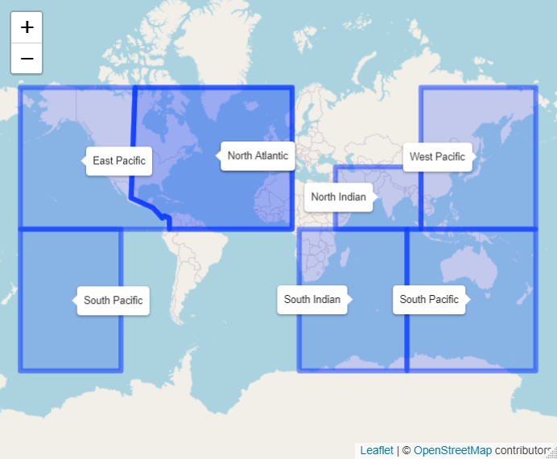
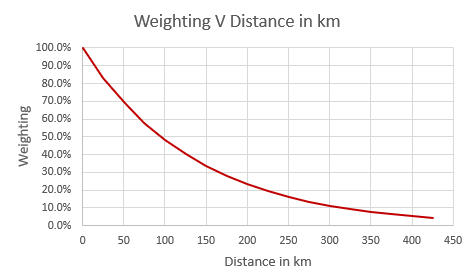

.. _glossary_reference-label:

Glossary 
============================================================

.. _g_asset_reference-label:

Asset 
------------------------------------------------------------
------------------------------------------------------------

The physical structure(s)/building(s) whose catastrophe risk you wish to model. This could be a single building or a wider area e.g., a town or whole island.

.. _g_assetvalue_reference-label:

Asset Value 
------------------------------------------------------------
------------------------------------------------------------

The total cost of re-building your :ref:`assets<g_asset_reference-label>`. This would also include any further economic loss from an :ref:`event<g_event_reference-label>` (e.g., lost revenue from business interruption).

.. _g_basin_reference-label:

Basin (Tropical Cyclone Basin) 
------------------------------------------------------------
------------------------------------------------------------

The distinct areas where tropical cyclones form. These are sometimes grouped slightly differently depending on the source of information. For the purposes of this app, the six basins and some of the areas that would fall into each basin are listed below.

      * North Atlantic: Covers the region around the Caribbean and the East Coast of North and Central America.
      * North Indian: Covers the Arabic peninsula, a large portion of coastal South Asia well as the  West coast of Africa. 
      * South Indian: Covers The Eastern coast of Africa and Southern Indian Ocean.
      * North-East Pacific: Covers the Western coast of Central and North America.
      * North-West Pacific: Covers a large portion of the Eastern coast of Asia and a number of islands in the Pacific ocean.
      * South Pacific: Covers Oceania.

There is some subjectivity over exactly where these basins begin and end. The image below shows the areas used to suggest the appropriate basin to the user in the :ref:`hazard<g_hazard_reference-label>` tab.

  
  Tropical Cyclone Basins: Hazard Tab Recommendations

.. _g_CHIRPS_reference-label:

CHIRPS data  
------------------------------------------------------------
------------------------------------------------------------

Climate Hazards Group InfraRed Precipitation with Station data (CHIRPS) is a 35+ year quasi-global rainfall data set. Spanning 50 degrees South to 50 degrees North (and all longitudes) and ranging from 1981 to near-present, CHIRPS incorporates our in-house climatology, CHPclim, 0.05° resolution satellite imagery, and in-situ station data to create gridded rainfall time series for trend analysis and seasonal drought monitoring. More more information on CHIRPS please see `here <https://www.chc.ucsb.edu/data/chirps>'_ and `here <https://www.nature.com/articles/sdata201566>`_. 

.. _g_convergence_reference-label:

Convergence  
------------------------------------------------------------
------------------------------------------------------------

Convergence is the process by which a random variable ends up settling at a particular value as more observations are generated. 
An example of this would be the average score of rolls of a six-sided dice (with each side numbered 1 to 6). Assume we try and estimate the average score of rolling this dice by rolling it repeatedly and averaging all our observations. On the first roll, we get a 5 so our estimate of the average is 5. On the second roll, we get a 3, so our average is now 4. After 40 rolls, our average is 3.7. 
As we repeat this process and roll the dice more and more times, we should start to see our estimate of the average stabilise at the actual average of 3.5. Convergence is the process by which we approach this true estimate after more observations/samples. 
The concept is relevant to the catastrophe modelling framework, as we hope to get a better estimate of the :ref:`loss<g_loss_reference-label>` by sampling a sufficient number :ref:`events<g_event_reference-label>`/years. Once we reach a certain number of :ref:`simulations<g_simulation_reference-label>` we would expect to see the :ref:`expected loss<g_expectedloss_reference-label>` “stabilise” at a certain value and not change meaningfully as we sample further. 

.. _g_damage_reference-label:

Damage 
------------------------------------------------------------
------------------------------------------------------------

The damage percentage records the level of loss to your exposure for different values of the intensity measure. Damage is closely linked to financial loss. 100% damage would mean total destruction of the exposure.

.. _g_event_reference-label:

Event 
------------------------------------------------------------
------------------------------------------------------------

A particular occurrence of a natural or man-made disaster. Events can refer to real-life historical events that have actually occurred or can also refer to hypothetical or simulated events 
generated for the purposes of modelling.

.. _g_eventset_reference-label:

Event Set 
------------------------------------------------------------
------------------------------------------------------------

The :ref:`event<g_event_reference-label>` set defines all the :ref:`events<g_event_reference-label>` that can occur within a given model. E.g., for the North-West Pacific :ref:`basin<g_basin_reference-label>` in the Risk Explorer, the event set is all of the tropical cyclones recorded by your  
selected :ref:`meteorological agency<g_agency_reference-label>` between 1978-2021.

.. _g_history_reference-label:

Experience/History 
------------------------------------------------------------
------------------------------------------------------------

A method of quantifying the expected loss to a cover based on what has happened in the past. Generally, this takes the form of an annual average
of the :ref:`losses<g_loss_reference-label>` that would have occurred throughout recent years, adjusting for any changes in the cover, :ref:`exposure<g_exposure_reference-label>` or other important external factors. "Experience" is sometimes used interchangeably with "History".

.. _g_exposure_reference-label:

Exposure
------------------------------------------------------------
------------------------------------------------------------

* Definition 1: Exposure is one of the key components of a catastrophe model, along with :ref:`hazard<g_hazard_reference-label>` and :ref:`vulnerability<g_vulnerability_reference-label>`. Exposure refers to the :ref:`assets<g_asset_reference-label>` you want to model or insure. The exposure(s) can be defined as a specific location(s), a list of :ref:`assets<g_asset_reference-label>`/buildings or an area that is to be protected by the insurance cover. This module interacts with the :ref:`hazard<g_hazard_reference-label>` and :ref:`vulnerability<g_vulnerability_reference-label>` modules to produce simulated :ref:`losses<g_loss_reference-label>`.

* Definition 2: An insurance term that refers to a method of quantifying the expected insurance loss to a cover based on the underlying :ref:`assets<g_asset_reference-label>` being covered. Typically, the way the exposure price is calculated will differ based on the type of asset being covered (e.g., a building's construction type).

.. _g_lossradius_reference-label:

Exposure Loss Radius/Area
------------------------------------------------------------
------------------------------------------------------------

The exposure loss area or radius refers to the area around the exposure within which recorded :ref:`events<g_event_reference-label>` would generate losses to your asset. The :ref:`latitudes and longitudes<g_latlong_reference-label>` included in the track data refer only to the position of the cyclone's eye (or centre). 
We therefore need to make an assumption of whether a loss generating windspeed/pressure would be recorded as a loss to your exposure, based on how close any given storm in the hazard data passes. With the tool's current assumptions, it is assumed that any storm within 87.6km "hits" the exposure as we assume all storms have an RMW of 87.6km.

.. _g_expectedloss_reference-label:

Expected Loss
------------------------------------------------------------
------------------------------------------------------------

An estimate of the loss generated in an average year. This can be calculated using any number of different methods and may be weighted based on the probabilities of different outcomes occurring. Expected loss can also refer to loss to an insurance cover as well as an asset.

.. _g_frequency_reference-label:

Frequency 
------------------------------------------------------------
------------------------------------------------------------

An estimate of how often an :ref:`event<g_event_reference-label>` occurs on average. Frequencies in this tool are generally defined on an annual basis. That is, an :ref:`event<g_event_reference-label>` with a frequency of 0.2 has a 20% chance of occurring in any given year, or on average would be expected to occur once in a 5 year period. Note that an :ref:`event<g_event_reference-label>` of this frequency could occur more than once in that period. 

.. _g_hazard_reference-label:

Hazard 
------------------------------------------------------------
------------------------------------------------------------

Hazard is one of the key components of a catastrophe model, along with :ref:`exposure<g_exposure_reference-label>` and :ref:`vulnerability<g_vulnerability_reference-label>`. The main purpose of the Hazard module is to determine the level of physical risk from an :ref:`event<g_event_reference-label>` at each potential :ref:`exposure<g_exposure_reference-label>` location. One example of a hazard component is the :ref:`IBTrACS<g_ibtracs_reference-label>` data that feeds this model. For any area in a tropical cyclone :ref:`basin<g_basin_reference-label>`, it contains a record of the historic wind speeds from 
previous cyclones. These wind speeds are used as a measure of the relative cyclone "hazard" at each location. This module interacts with the :ref:`exposure<g_exposure_reference-label>` and :ref:`vulnerability<g_vulnerability_reference-label>` modules to produce simulated insurance losses.

.. _g_historicalloss_reference-label:

Historical Loss 
------------------------------------------------------------
------------------------------------------------------------

This is one method of generating an :ref:`expected loss <g_expectedloss_reference-label>`. The method takes an average of the :ref:`losses <g_loss_reference-label>` sustained over a period of history for your :ref:`exposure<g_exposure_reference-label>` point or area. For example, 
let's assume we have data across storms from 1978-2021. The data shows that over this period, your :ref:`exposure<g_exposure_reference-label>` area experienced two storms that would have each generated 100k USD :ref:`losses<g_loss_reference-label>`. The total is 200k averaged
over the 44 years of data, and so the average annual Historical Loss in this example would be USD 4,545. What we refer to as the historical loss here is often known as the "experience" or "burn" in the insurance industry.

.. _g_ibtracs_reference-label:

IBTrACS 
------------------------------------------------------------
------------------------------------------------------------

IBTrACS stands for International Best Track Archive for Climate Stewardship. According to their website, "IBTrACS merges Tropical Cyclone storm track datasets from :ref:`agencies<g_agency_reference-label>` around the world to create a global, best track Tropical Cyclone database". The data is open-source and can be accessed online at https://www.ncei.noaa.gov/data/international-best-track-archive-for-climate-stewardship-ibtracs/v04r00/access/csv/.
IBTrACS is the main source of :ref:`hazard<g_hazard_reference-label>` data for the Risk Explorer at present and is compiled by the US government body, NOAA (National Oceanic and Atmospheric Administration).

.. _g_intensitymeasure_reference-label:

Intensity Measure 
------------------------------------------------------------
------------------------------------------------------------

The intensity measure is the :ref:`event<g_event_reference-label>`-specific measurement that will be used to determine whether an :ref:`event<g_event_reference-label>` leads to a :ref:`loss<g_loss_reference-label>` or not. The intensity measurement chosen should closely relate to the damage potential of the :ref:`event<g_event_reference-label>` and the likelihood of it causing a :ref:`loss<g_loss_reference-label>`. 
For example, wind speed or pressure would be suitable intensity measures for a storm, as they closely relate to the amount of :ref:`damage<g_damage_reference-label>` likely to be caused to the :ref:`exposure<g_exposure_reference-label>` of interest. Recordings of the intensity measure within your defined :ref:`exposure<g_exposure_reference-label>` area will determine how much :ref:`loss<g_loss_reference-label>` is caused by an :ref:`event<g_event_reference-label>`. 

.. _g_intensityvalue_reference-label:

Intensity Values
------------------------------------------------------------
------------------------------------------------------------

The value(s) specified for the intensity measure which each correspond to a given level of :ref:`damage<g_damage_reference-label>` to your asset. The values entered here and vulnerability curve type are used to generate loss figures for each event in your hazard data.
:ref:`Losses<g_loss_reference-label>` increase or decrease with the intensity of the intensity measure. E.g., a category 1 storm might generate :ref:`damage <g_damage_reference-label>` equating to 50% of the asset’s value, whereas a category 2 storm might generate :ref:`damage<g_loss_reference-label>` of 75% of the asset’s value. 

.. _g_interpolation_reference-label:

Interpolation
------------------------------------------------------------
------------------------------------------------------------

Interpolation refers to the estimation of new data from existing data. E.g., say we have storm tracks at 6-hour intervals, but wish to estimate values at 15 minute intervals too. Interpolation allows us to come up with estimates for these intermediate points based on the values we already have for the 6-hour intervals.

.. _g_idf_reference-label:

Insurance Development Forum 
------------------------------------------------------------
------------------------------------------------------------

The IDF is a public/private partnership led by the insurance industry and supported by international organisations. The IDF was first announced at the United Nations Conference of the Parties 
(COP21) Paris Climate summit in 2015 and was officially launched by leaders of the United Nations, the World Bank and the insurance industry in 2016. For more information see www.insdevforum.org.

.. _g_latlong_reference-label:

Latitude-Longitude 
------------------------------------------------------------
------------------------------------------------------------

This term is often abbreviated to lat-long. Latitude and longitude can be thought of as a global coordinate system, any location on the earth's surface can be defined by a given pair of latitude
and longitude values. Longitude can be thought of as how far east or west a location is, while latitude represents how far north or south a location is. Longitude values range from 180 degrees East (+180) to 180 degrees West (-180), 
with the Greenwich meridian lying at zero. Unlike latitudes, longitudes repeat on themselves, -180 and +180 represent the same point (the international date line). Latitude values can range from 90 degrees South (-90) to 90 
degrees North(+90), a latitude of 0 means that a location lies on the equator.  

.. _g_loss_reference-label:

Loss 
------------------------------------------------------------
------------------------------------------------------------

Loss refers to the financial cost of restoring a physical asset to its previous state after it has been hit by an :ref:`event<g_event_reference-label>`. This would cover the cost of any re-building work, as well as any economic loss suffered as a result of interruption to business activities.

.. _g_agency_reference-label:

Meteorological Agency 
------------------------------------------------------------
------------------------------------------------------------

Meteorological agencies are government bodies that take their own measurements of tropical cyclone wind speeds and tracks which are then uploaded into :ref:`IBTrACS<g_ibtracs_reference-label>`. Data can be loaded from a number
of agencies to be used in the Risk Explorer. The below provides a list of the shorthand names of each agency and a more detailed description of each:

* USA: Any US meteorological agency
* Tokyo: RSMC (Regional Specialised Meteorological Centre) Tokyo 
* CMA: Chinese Meteorological Administration
* HKO: Hong Kong Observatory
* NewDelhi: RSMC (Regional Specialised Meteorological Centre) New Delhi, India
* Reunion: RSMC (Regional Specialised Meteorological Centre) La Reunion
* BoM: Australian Bureau of Meteorology
* Nadi: RSMC (Regional Specialised Meteorological Centre) Nadi, Fiji
* Wellington: TCWC Wellington, New Zealand

.. _g_mmi_reference-label:

Modified Mercalli Intensity Scale
------------------------------------------------------------
------------------------------------------------------------

The Modified Mercalli Intensity Scale (frequently abbreviated to MMI) categorises earthquakes in terms of their severity and how they are generally felt by people. The table below shows the different categories on the MMI scale as well as their corresponding :ref:`pga<g_pga_reference-label>` values.

.. list-table:: MMI Intensities 
   :widths: 30 20 60 
   :header-rows: 1

   * - Intensity
     - PGA(%g)
     - Ground Conditions 
   * - 1. Not felt
     - <0.17
     - Not felt except by very few under especially favorable conditions. 
   * - II. Weak
     - 0.17-1.4
     - Felt only by a few people at rest, especially on upper floors of buildings. Delicately suspended objects may swing.
   * - III. Weak
     - 0.17-1.4
     - Felt quite noticeably by people indoors, especially on upper floors of buildings: Many people do not recognize it as an earthquake. Standing vehicles may rock slightly. Vibrations are similar to the passing of a truck, with duration estimated   
   * - IV. Light
     - 1.4-3.9
     - Felt indoors by many, outdoors by few during the day: At night, some are awakened. Dishes, windows, and doors are disturbed; walls make cracking sounds. Sensations are like a heavy truck striking a building. Standing vehicles are rocked noticeably.
   * - 5. Moderate
     - 3.9-9.2
     - Felt by nearly everyone; many awakened: Some dishes and windows are broken. Unstable objects are overturned. Pendulum clocks may stop.
   * - VI. Strong
     - 9.2-18
     - Felt by all, and many are frightened. Some heavy furniture is moved; a few instances of fallen plaster occur. Damage is slight.
   * - VII. Very Strong
     - 18-34
     - Damage is negligible in buildings of good design and construction; but slight to moderate in well-built ordinary structures; damage is considerable in poorly built or badly designed structures; some chimneys are broken. Noticed by motorists.
   * - VIII. Severe
     - 34-65
     - Damage slight in specially designed structures; considerable damage in ordinary substantial buildings with partial collapse. Damage great in poorly built structures. Fall of chimneys, factory stacks, columns, monuments, walls. Heavy furniture overturned. Sand and mud ejected in small amounts. Changes in well water. Motorists are disturbed.
   * - IX. Violent
     - 65-124
     - Damage is considerable in specially designed structures; well-designed frame structures are thrown out of plumb. Damage is great in substantial buildings, with partial collapse. Buildings are shifted off foundations. Liquefaction occurs. Underground pipes are broken.
   * - 10. Extreme
     - > 124
     - Some well-built wooden structures are destroyed; most masonry and frame structures are destroyed with foundations. Rails are bent. Landslides considerable from river banks and steep slopes. Shifted sand and mud. Water splashed over banks.
   * - XI. Extreme
     - > 124
     - Few, if any, (masonry) structures remain standing. Bridges are destroyed. Broad fissures erupt in the ground. Underground pipelines are rendered completely out of service. Earth slumps and land slips in soft ground. Rails are bent greatly.
   * - XII. Extreme
     - > 124
     - Damage is total. Waves are seen on ground surfaces. Lines of sight and level are distorted. Objects are thrown upward into the air.

.. _g_oasis_reference-label:

Oasis 
------------------------------------------------------------
------------------------------------------------------------

Oasis is a not-for-profit company, owned by close to 30 insurers, reinsurers and brokers. Its aim is to open up catastrophe modelling by increasing both the user-base and supply. The company was founded 
in 2012 and aims to build a wider community of those interested in catastrophe risk across business, academia and government. For more information see oasislmf.org.

.. _g_payout_reference-label:

Payout
------------------------------------------------------------
------------------------------------------------------------

Payout refers to the amount received by a policyholder when an :ref:`event<g_event_reference-label>` triggers their policy. Where you are using the vulnerability section to model a parametric insurance cover, payout and loss can be understood as being essentially the same thing.

.. _g_pga_reference-label:

Peak Ground Acceleration
------------------------------------------------------------
------------------------------------------------------------

Peak Ground Acceleration is a measurement of how hard the ground shakes during an earthquake at a given location. Due to its close link to damage sustained, it is often used as an intensity measure for the earthquake peril. It is recorded in terms of the earth’s standard acceleration due to gravity (denoted %g). 
Values of this measure correspond to different intensities of the Modified Mercalli Intensity Scale which is used to classify the severity of earthquakes.

.. _g_percentasset_reference-label:

Percentage of Asset Value
------------------------------------------------------------
------------------------------------------------------------

A method of stating the :ref:`loss <g_loss_reference-label>` to an asset by expressing it as a percentage of the :ref:`asset value<g_assetvalue_reference-label>`. The reason for expressing :ref:`losses<g_loss_reference-label>` in this way is it enables us to compare the relative burden of :ref:`losses<g_loss_reference-label>` for different assets regardless of the financial amount. 
E.g., an asset worth USD 1m has an average expected loss of USD 100,000 whereas another worth USD 10,000 has an average expected loss of USD2,000. The average percentage of asset value lost is 20% in the second case compared to 10% in the first case. Despite the amounts involved being smaller there is more relative risk to the second asset compared to the first. Being able to make this comparison is useful and gives us a comparison of how often an asset might be affected by events.

.. _g_percentile_reference-label:

Percentile
------------------------------------------------------------
------------------------------------------------------------

Percentile refers to the total percentage of values that are below a given value in the distribution. 
Exhibit 4 in the Analysis tab displays this metric for each loss value. E.g., if a :ref:`loss<g_loss_reference-label>` of USD 100 has a percentile of 50%, this means that 50% of simulations have a :ref:`loss<g_loss_reference-label>` of equal to USD 100 or less. Likewise for the 98th percentile, only 2% of simulations have a higher loss and 98% have an equal or smaller loss.
 
.. _g_peril_reference-label:

Peril 
------------------------------------------------------------
------------------------------------------------------------

Peril is often used interchangeably with ‘:ref:`hazard<g_hazard_reference-label>`’ and describes the process or type of :ref:`event<g_event_reference-label>` that can lead to an insurance loss. Examples of peril types include:

* Tropical Cyclone
* Flooding
* Earthquake
* Wildfire
* Extra-Tropical Cyclone
* Convective Storm 
* Winter Storm

Note that our definition within the Risk Explorer is limited to natural perils, however insurance covers can also include man-made perils such as building fire, terrorism or theft. 

.. _g_reinstatement_reference-label:

Reinstatement 
------------------------------------------------------------
------------------------------------------------------------

A reinstatement refers to a "reinstatement of cover". This means your insurance cover can reinstate
Reinstatements allow you to receive a :ref:`payout<g_payout_reference-label>` once you have "used" up your cover i.e., received the maximum payout over the course of a year. The number of reinstatements dictates how many additional times you can receive the total maximum payout in a year. 
If you have zero reinstatements, the cover will only pay up to your maximum once in a given year. In the case of this model, there is an implicit assumption of no reinstatements as you are modelling the full value of your asset. 

.. _g_returnperiod_reference-label:

Return Period 
------------------------------------------------------------
------------------------------------------------------------

Return period refers to the average time you would have to wait before observing a given :ref:`event<g_event_reference-label>` or a loss of a given amount. E.g., a return period of 5 years for a cat 2 storm means you would expect to have one storm at cat 2 or above every 5 years on average. Of course this is an average, and it is possible to have two 100-year :ref:`events<g_event_reference-label>` occur in subsequent years. An :ref:`event<g_event_reference-label>` with a 100-year :ref:`event<g_event_reference-label>` return period in terms of hurricane category may not equate to a 100-year loss return period (for example if there was little :ref:`exposure<g_exposure_reference-label>` hit, resulting in a low loss).
The return period also communicates the probability of occurrence in any given year. A 10-year return period means there is a roughly 1 in 10 (10%) chance of an :ref:`event<g_event_reference-label>` (or loss) happening in any given year. For relatively rare :ref:`events<g_event_reference-label>`, return periods can be considered the reciprocals of frequencies, e.g., an :ref:`event<g_event_reference-label>` (or loss) with a :ref:`frequency<g_frequency_reference-label>` of 0.1 has a return period of around 10 years as 1 / 0.1 = 10. 

.. _g_rmw_reference-label:

RMW (Radius of Maximum Wind Speeds) 
------------------------------------------------------------
------------------------------------------------------------

The radius of maximum wind (RMW) is the distance between the centre of a cyclone and its band of strongest winds (fastest windspeeds). This is an important consideration for the Risk Explorer as it tells us how wide an area maximum wind speeds are likely to be recorded in. 
For the purposes of the Risk Explorer, the assumed radius of maximum wind speeds is defined to be 87.6km in all cases. This figure is based on a 2021 paper by Perez-Alarcon et al. which suggests this is the average radius observed in the Atlantic basin.

.. _g_simulation_reference-label:

Simulation 
------------------------------------------------------------
------------------------------------------------------------

A simulation typically refers to a specific "run" of a model. A run will produce a distinct set of outcomes generated by a simulation model. 
For Historical IBTrACS data in the Risk Explorer, we are trying to simulate :ref:` losses<g_loss_reference-label>` at a randomly sampled location over the history of the :ref:`IBTrACS<g_ibtracs_reference-label>` data-set. As such, one "simulation" can be thought of as the average losses generated at one distinct simulated location over the course of all the years in the history.
By contrast, for :ref:`stochastic<g_stochastic_reference-label>` sets, each simulation represents a year of losses at the selected location. This is an important distinction as each simulation with the stochastic set represents an individual year as opposed to a range of years in the historical data. As such you will need more simulations to get a reliable estimate with the :ref:`stochastic<g_stochastic_reference-label>` set as there is already substantial variability in each simulation under the IBTrACS approach.
A large number of simulations are typically required to get a reliable result, hence 500 is the minimum number of simulations that can be run in the model.

.. _g_simyear_reference-label:

Simulation-Year 
------------------------------------------------------------
------------------------------------------------------------

For IBTrACS data, a :ref:`simulation-year<g_simyear_reference-label>` refers to the :ref:`loss<g_loss_reference-label>` sustained in a given historical year of the :ref:`hazard<g_hazard_reference-label>` data for a given :ref:`simulation<g_simulation_reference-label>`. For example, 5-2003 refers to the 2003 :ref:`loss<g_loss_reference-label>`
in :ref:`simulation<g_simulation_reference-label>` 5. In order to generate :ref:`expected losses<g_expectedloss_reference-label>` for each :ref:`simulation<g_simulation_reference-label>`, we need to average across all years within that :ref:`simulation<g_simulation_reference-label>`.
For stochastic data, each simulation is an individual year so simulation-year and simulation are the same thing.

.. _g_sscategory_reference-label:

Saffir-Simpson Category 
------------------------------------------------------------
------------------------------------------------------------

A Saffir-Simpson category represents a level of hurricane intensity on the Saffir-Simpson scale which is commonly used by meteorologists and the insurance industry. The Saffir-Simpson scale
uses the measurement of sustained 1-minute maximum wind speeds to categorise hurricanes by intensity. The categories range from 1-5 with 5 being the highest intensity and 1 the lowest. Note that a category 1 hurricane still 
represents a strong storm and the majority of tropical storms are far weaker than a category 1. The table below shows the relevant wind speeds for each category:

.. list-table:: Saffir-Simpson Categories 
   :widths: 30 30 30 
   :header-rows: 1

   
   * - Category
     - km/h
     - mph 
   * - 1
     - 119-154
     - 74-96
   * - 2
     - 154-178
     - 96-111
   * - 3
     - 178-209
     - 111-130
   * - 4     
     - 209-252
     - 130-157
   * - 5
     - >252
     - >157

It's worth noting that while the Saffir-Simpson scale is a useful tool for measuring hurricane intensity, it does not include the impact of flooding or storm surge. These variables can vary a lot by storm 
and can have a serious impact on economic and :ref:`insured losses<g_loss_reference-label>`.

.. _g_lossrank_reference-label:

Simulated Loss Rank
------------------------------------------------------------
------------------------------------------------------------

After all :ref:`simulations<g_simulation_reference-label>` have been run, the losses for each :ref:`simulation<g_simulation_reference-label>` are ordered from highest to lowest. The :ref:`simulation<g_simulation_reference-label>` with the highest average loss would be ranked 1st, the next highest 2nd and so on. 

.. _g_stdev_reference-label:

Standard Deviation 
------------------------------------------------------------
------------------------------------------------------------

Standard deviation is a measure of the amount of variation that exists in a data set. The higher this number, the more spread out the data generally is from the mean or average. The lower 
the standard deviation, the more observations tend to be close to the mean value. The formula for calculating this can be found online and is available in nearly all spreadsheet applications. For nearly all distributions, 75% or more of observations will lie within 2 standard deviations of the mean value and at least 89% will lie within 3 standard deviations. 

.. _g_simulationloss_reference-label:

Simulation Loss
------------------------------------------------------------
------------------------------------------------------------

For :ref:`stochastic<g_stochastic_reference-label>` hazard data, the simulation loss simply represents the average annual loss to your exposure across all simulations run. This measure can be thought of as being equivalent to the unweighted or weighted simulation loss for IBTrACS data.

.. _g_stochastic_reference-label:

Stochastic 
------------------------------------------------------------
------------------------------------------------------------

:ref:`Events<g_event_reference-label>` that are stochastic follow a random distribution or pattern, however aren't exactly forecastable. This term is often used in the context of an :ref:`event set<g_eventset_reference-label>`. Stochastic event sets in the Risk Explorer refer to hazard data put together by catastrophe modelling experts which aim to simulate the underlying randomness of natural catastrophes.

.. _g_triggermeasure_reference-label:

Trigger Measure 
------------------------------------------------------------
------------------------------------------------------------

The trigger measure is the :ref:`event<g_event_reference-label>`-specific measurement that will be used to determine whether an :ref:`event<g_event_reference-label>` leads to an insurance payout under a parametric insurance cover or not. The trigger measurement chosen should closely relate to the :ref:`damage<g_damage_reference-label>` potential of the event.
The trigger measure and intensity measure in the vulnerability function are closely related and can essentially be thought of as the same thing when you are modelling a parametric cover in the tool.

.. _g_unweightedsimloss_reference-label:

Unweighted Simulation Loss 
------------------------------------------------------------
------------------------------------------------------------

For IBTrACS hazard data, this is the average annual loss across all :ref:`simulations<g_simulation_reference-label>` with no weighting for proximity to the :ref:`exposure<g_exposure_reference-label>` applied. The downside of using this method is that it may unduly
weight :ref:`simulations<g_simulation_reference-label>` a long way from the :ref:`exposure<g_exposure_reference-label>`. However, it can be a useful point of comparison to the :ref:`weighted simulation loss<g_weightedsimloss_reference-label>`, as it will give us an idea of how much impact the weighting function is having on the metric.

.. _g_vulnerability_reference-label:

Vulnerability 
------------------------------------------------------------
------------------------------------------------------------

Vulnerability is one of the key components of a catastrophe model, along with :ref:`exposure<g_exposure_reference-label>` and :ref:`hazard<g_hazard_reference-label>`. Vulnerability defines how physical :ref:`events<g_event_reference-label>` translate into :ref:`damage<g_damage_reference-label>`/financial loss. In the Risk Explorer, this is achieved through defining a relationship between the damage percentage and intensity measure. 
This module interacts with the :ref:`exposure<g_exposure_reference-label>` and :ref:`hazard<g_hazard_reference-label>` modules to produce simulated :ref:`losses<g_loss_reference-label>`. In the Risk Explorer, the trigger measure is based on :ref:`hazard<g_hazard_reference-label>` intensity (windspeed or central pressure).
In the case of a parametric cover, the financial loss is solely defined by your triggers/insurance structure because given values of your trigger measure lead to specific :ref:`losses<g_loss_reference-label>`. As such, for a parametric cover, vulnerability and the insurance structure itself are essentially the same thing.

.. _g_weighting_reference-label:

Weighting/Weighting Function 
------------------------------------------------------------
------------------------------------------------------------

For IBTrACS hazard data, the weighting is the degree of importance given to a particular value in a calculation, e.g. a weighting of 0.2 implies the value has double the relative importance on the calculation as a value with a weighting of 0.1 would.  The weighting function is a formula that takes the distance of the :ref:`simulation<g_simulation_reference-label>` from the initial :ref:`exposure<g_exposure_reference-label>` as an input and produces a weight between 0 and 1 to apply to the 
:ref:`simulation<g_simulation_reference-label>` as an output. The idea is to give a higher weighting to observations that lie closer to the :ref:`exposure<g_exposure_reference-label>` in the final calculation. There are a number of potential weighting methods that could be used
to do this. An exponential weighting function with a lambda parameter of 3.2 is selected for calculating the weightings in this model based on scientific and actuarial expert judgement. 

Exhibit demonstrating relationship between distance from :ref:`exposure<g_exposure_reference-label>` and weight for a single location.

.. _g_weightedsimloss_reference-label:

Weighted Simulation Loss 
------------------------------------------------------------
------------------------------------------------------------

For IBTrACS hazard data, this is the average annual loss across all your :ref:`simulations<g_simulation_reference-label>` including the weighting for proximity to the :ref:`exposure<g_exposure_reference-label>` applied. This is one of the main 
outputs from the simulation approach. See the :ref:`sim_workings_reference-label` in the FAQs section for a more detailed discussion of how this is calculated.
