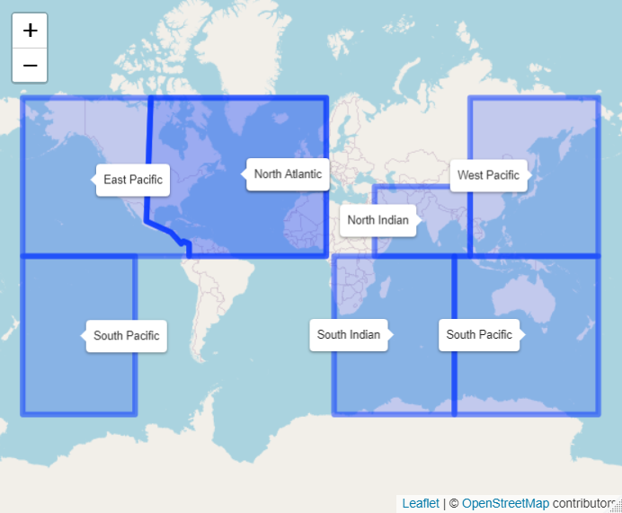

.. _introduction_reference-label:

Introduction
==========================================================

These pages provide a step-by-step guide to running the Risk Explorer tool and give more general background on the tool's uses and limitations.

What is the Oasis Risk Explorer?
---------------------------------
The :ref:`Oasis<g_oasis_reference-label>` Risk Explorer is a tool developed by the :ref:`Insurance Development Forum<g_idf_reference-label>` in partnership with :ref:`Oasis<g_oasis_reference-label>` and `Maximum Information <https://www.maxinfo.io/>`_. The central purpose of this tool is educational, serving as an introduction to the different considerations that go into modelling catastrophe risk with specific applications to parametric insurance.

The tool aims to guide users through the different elements that need to be considered when modelling catastrophe risk. Each of these elements is broken out into separate tabs that form the basic building blocks of the model. 

  
  Risk Explorer Toolbar Displaying the Application's Different Tabs 

The first three sections (excluding the introduction) require inputs from the user that define how the risk will be modelled:

* **Hazard:** What type of natural hazard :ref:`events<g_event_reference-label>`, or perils, are you interested in modelling (or providing parametric insurance for) and what data should be used to model them?
* **Exposure:** Which location(s) or area are you interested in providing parametric insurance for?
* **Vulnerability:** How will the physical :ref:`events<g_event_reference-label>` in the model lead to :ref:`damage<g_damage_reference-label>` and financial :ref:`loss<g_loss_reference-label>`?

The next three sections allow the user to run modelling and view outputs from their modelling:

* **Simulation:** Once :ref:`hazard<g_hazard_reference-label>`, :ref:`exposure<g_exposure_reference-label>` and :ref:`vulnerability<g_vulnerability_reference-label>` are specified, this is where you can run simulation modelling.
* **Events:** Once your :ref:`simulations<g_simulation_reference-label>` are complete, this tab will allow you to examine the model's output in more detail. The main goal of this tab is to give a better sense of the type of events that occur in the simulations.
* **Payouts:** Once your :ref:`simulations<g_simulation_reference-label>` are complete, this tab will allow you to analyse the payouts generated by the hypothetical cover you are modelling. You can also export csv files here for further analysis.

.. _regionperilscope_reference-label:

What regions and perils can the tool model?
---------------------------------------------------------------

Tropical Cyclone
-------------------
-------------------

The Risk Explorer is able to model tropical cyclone worldwide using :ref:`IBTrACS<g_ibtracs_reference-label>` historical cyclone track data. The map below shows the different basins covered by the tool:

  Tropical Cyclone Basins (Note these boundaries are somewhat arbitrary, however this should give you a rough idea of which areas you would expect to see tropical cyclone activity in).

The model also includes selected :ref:`stochastic<g_stochastic_reference-label>` hazard sets to provide another view of the hazard. These stochastic sets represent thousands of years of hypothetical events developed by catastrophe model developers: 

.. figure:: ../docs_img/region_coverage_tc.png  
  :scale: 75%
  :alt: Tropical Cyclone Stochastic Data Regions

  Tropical cyclone stochastic hazard datasets included are the Ginoza Region of Japan (courtesy of Aon Impact Forecasting) and Bangladesh (courtesy of Oasis). 

For detailed methodology and assumptions/limitations, please see the dedicated :ref:`Tropical Cyclone section<sectionTC_reference-label>`.

Drought Weather Index
----------------------
----------------------

The Risk Explorer is able to model drought worldwide using :ref:`CHIRPS<g_CHIRPS_reference-label>` historical satellite rainfall data. 
The map below shows the regions covered, these correspond to the IPCC SREX regions with areas with little land and/or outside the CHIRPS 50S -50N region excluded. For detailed methodology and assumptions/limitations, please see the dedicated :ref:`Drought Weather Index section<sectionDR_reference-label>`.

  Drought CHIRPS Data Regions

Earthquake
-------------------
-------------------

The Risk Explorer contains a selected :ref:`stochastic<g_stochastic_reference-label>` hazard set for modelling the earthquake hazard in the Karachi area of Pakistan, courtesy of by Aon Impact Forecasting. For detailed methodology and assumptions/limitations, please see the dedicated :ref:`Earthquake section
<sectionEQ_reference-label>`.

Next steps
------------------
------------------

To become more familiar with the tool in general, see :ref:`How should this model be used?<howtouse_reference-label>`.

To become more familiar with the principles of parametric insurance, see :ref:`What is parametric insurance?<parametric_reference-label>`.

